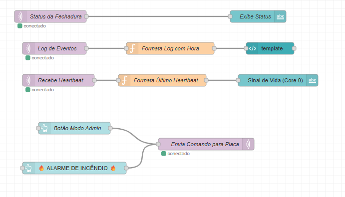
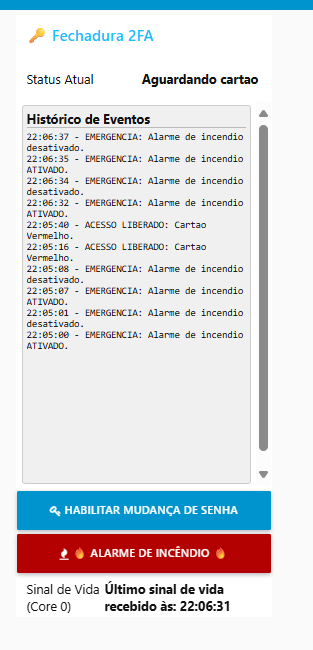

# Projeto 1 BitDogLock 2FA: Sistema de Controle de Acesso Inteligente


**Desenvolvido na plataforma BitDogLab, uma placa de desenvolvimento baseada no Raspberry Pi Pico W, para simular uma fechadura eletrônica.**

## 🎯 Objetivo Pedagógico

O principal objetivo deste projeto é proporcionar ao estudante uma compreensão aprofundada e prática sobre:

* **Entrada e Saída Digital (GPIO):** Interação direta com sensores digitais (como o teclado matricial), LEDs e outros atuadores simples.
* **Comunicação I2C:** Leitura de dados de sensores complexos (sensor de cor TCS34725) e controle de um display OLED para feedback visual.
* **Controle de PWM:** Acionamento de um servo motor para simular a abertura/fechamento de uma porta.
* **Lógica de Estados:** Implementação de uma máquina de estados robusta para gerenciar o fluxo complexo do sistema.
* **Integração de Sensores com Atuadores:** Coordenação eficiente entre a leitura de dados de múltiplos sensores e as respostas dos atuadores.
* **Conectividade Wi-Fi e MQTT:** Publicação de eventos e status do sistema em tempo real para um dashboard remoto, habilitando a monitorização e interação via IoT.
* **Processamento Dual-Core (RP2040):** Demonstração da otimização de desempenho através do *offloading* de tarefas de rede para o Core 1, liberando o Core 0 para a lógica crítica da aplicação.
* **Programação Não-Bloqueante:** Foco na implementação de drivers e lógica que permitem a execução de múltiplas tarefas sem interrupções (polling e timers), garantindo um sistema responsivo.

## ✨ Funcionalidades Principais

O BitDogLock 2FA simula uma fechadura eletrônica inteligente com as seguintes capacidades:

1.  **Autenticação de Duplo Fator (2FA):**
    * **Fator 1 (Cartão de Cor):** Um sensor de cor **TCS34725** identifica cartões coloridos (Verde, Vermelho ou Azul), agindo como o primeiro fator de autenticação.
    * **Fator 2 (Senha Numérica):** Após a detecção do cartão, uma senha numérica de 4 dígitos deve ser digitada em um teclado matricial para completar a autenticação.

2.  **Controle de Acesso:**
    * A combinação correta de cartão e senha aciona um **servo motor SG90** que simula a abertura da fechadura.
    * A fechadura possui um **auto-travamento** configurável após um período de tempo.

3.  **Feedback Abrangente ao Usuário:**
    * **Display OLED (0.96" I2C):** Exibe o status do sistema, mensagens de instrução e feedback (aguardando cartão, aguardando senha, acesso liberado/negado, modo de administração).
    * **Matriz de LEDs WS2812B (Neopixel):** Oferece feedback visual dinâmico com animações para diversas situações (erro, sucesso, digitação, tempo restante, modo de emergência).
    * **LED RGB (Cátodo Comum):** Indica o status geral do sistema através de cores e efeitos de pulso (azul para espera, verde para aberto, amarelo para senha, vermelho para emergência).
    * **Buzzer Passivo:** Fornece feedback sonoro para ações (digitação de tecla, sucesso, erro, timeout, alarmes).

4.  **Monitoramento e Controle Remoto (IoT):**
    * Todos os eventos de acesso (tentativas, sucesso, falha, timeout, auto-travamento, alteração de senha) e o status do sistema são publicados via **MQTT** para um dashboard **Node-RED**.
    * O dashboard permite o acompanhamento em tempo real e o envio de comandos para o sistema (ex: ativar modo administrador, alarme de incêndio).

5.  **Modo de Administração:**
    * Um modo especial permite a **alteração das senhas numéricas** associadas a cada cor de cartão.

6.  **Modo de Emergência (Incêndio):**
    * Pode ser ativado remotamente via MQTT, simulando um alarme de incêndio com feedback visual e sonoro intensos (LED vermelho pulsante, animação de fogo na matriz, bipes contínuos).

## 📦 Hardware Necessário

Para reproduzir este projeto, você precisará da plataforma **BitDogLab** equipada com:

* **Raspberry Pi Pico W**
* **Display OLED (0.96" 128x64 I2C)**
* **Matriz de LEDs WS2812B (Neopixel) 5x5**
* **LED RGB (Cátodo Comum)**
* **Buzzer Passivo**
* **Sensor de Cor TCS34725**
* **Teclado Matricial 4x4:** Conectado através de um adaptador "plug and play" que se encaixa diretamente no conector periférico de 14 pinos da BitDogLab, eliminando a necessidade de fiação individual.
* **Servo Motor SG90**
* **Cartões de Cor:** Cartões simples nas cores Verde, Vermelho e Azul para o fator 1 de autenticação.

## ⚙️ Configuração do Ambiente

1.  **Ambiente de Desenvolvimento:** Este projeto é desenvolvido em C utilizando o SDK oficial da Raspberry Pi Pico. Certifique-se de ter o ambiente de desenvolvimento configurado (Recomendado: VS Code com as extensões necessárias para Pico/C/C++, como a Extensão Raspberry Pi Pico e a CMake Tools, ambas disponiveis na aba extensões do VS Code).
3.  **Bibliotecas Adicionais:** Todos os drivers personalizados para os periféricos (TCS34725, OLED, Matriz, etc.) estão incluídos diretamente no repositório do firmware.
4.  **Node-RED:** Instale o Node-RED em seu computador.
5.  **Broker MQTT:** Um broker MQTT (como Mosquitto) é necessário e deve estar acessível pela sua rede.

## 📂 Estrutura do Código

O firmware está organizado em módulos claros para facilitar a compreensão e a manutenção:

* `main.c`: Contém a lógica principal da máquina de estados do sistema, a orquestração dos diferentes modos de operação e a interação central com os drivers do Core 0.
* `funcao_wifi_nucleo1()`: Função executada no Core 1 (Raspberry Pi Pico W), dedicada à conectividade Wi-Fi e à comunicação MQTT, otimizando o desempenho do Core 0.
* `configura_geral.h`: Arquivo centralizado com definições globais, mapeamento de pinagem para todos os periféricos, e as configurações do seu broker MQTT (`MQTT_BROKER_IP` / `MQTT_BROKER_PORT`).
* `secrets.h`: Ele armazena as credenciais da sua rede Wi-Fi (`WIFI_SSID` e `WIFI_PASS`). 
* `display.c/.h`: Driver para o display OLED I2C, incluindo suporte a caracteres acentuados.
* `matriz.c/.h`: Driver e funções para o controle da matriz de LEDs WS2812B, com diversas animações visuais.
* `keypad.c/.h`: Driver para o teclado matricial 4x4, incluindo debounce por software para leituras precisas.
* `tcs34725.c/.h`: Driver para o sensor de cor TCS34725.
* `rgb_led.c/.h`: Driver para o LED RGB (cátodo comum), com controle de brilho via PWM.
* `buzzer.c/.h`: Funções para o buzzer passivo, permitindo a reprodução de tons e melodias.
* `servo.c/.h`: Funções para controle do servo motor, com otimização de energia.
* `feedback.c/.h`: Módulo de alto nível que orquestra as respostas visuais e sonoras complexas (animações de erro, sucesso, timeout, fechamento).
* `mqtt_lwip.c/.h`: Interface de comunicação MQTT baseada na pilha LWIP, com fila de publicações para operações não-bloqueantes.
* `lwipopts.h`: Configurações personalizadas da pilha TCP/IP LWIP para o Raspberry Pi Pico W.
* `ssd1306_font.h`: Tabela de caracteres bitmap para o display OLED, incluindo caracteres acentuados.

## 🚀 Instruções de Uso

Siga os passos abaixo para colocar o BitDogLock 2FA em funcionamento:

1.  **Montagem do Hardware:**
    * Conecte todos os componentes à sua placa BitDogLab, prestando atenção às suas interfaces:
        * **Sensor de Cor (TCS34725):** Conecte-o a uma das portas I2C da BitDogLab (o projeto utiliza I2C0: SDA no GPIO0, SCL no GPIO1) .
        * **Servo Motor (SG90 ou outro modelo):** Conecte-o ao pino GPIO configurado para PWM na BitDogLab (o projeto utiliza o GPIO2). **Se o seu kit BitDogLab inclui um adaptador para servo no conector CN9, use-o para simplificar a fiação; este adaptador roteará o sinal PWM do GPIO2 para o servo.**
        * **Teclado Matricial 4x4:** Utilize o adaptador "plug and play" fornecido no kit da BitDogLab, conectando-o diretamente ao conector periférico de 14 pinos.
        * **Demais componentes (Display OLED, Matriz de LEDs, LED RGB, Buzzer):** Utilizam o mapeamentos de pinos padrão da BitDogLab
    * **Caso não possua os adaptadores do kit BitDogLab:** As conexões podem ser feitas manualmente com cabos jumper fêmea-fêmea. No entanto, a correção dos pinos no arquivo `configura_geral.h` será necessária para corresponder às suas novas conexões.
    * * **Tópicos MQTT utilizados pelo sistema (com o `DEVICE_ID` padrão "bitdoglab_02"):**
        * **Para Comandos (Node-RED para Pico W):**
            * `bitdoglab_02/comando/estado` (Para comandos como "ADMIN_SENHA" ou "INCENDIO"
        * **Para Status e Logs (Pico W para Node-RED):**
            * `bitdoglab_02/status` (Status atual do sistema, ex: "Aguardando cartao", "Sistema Aberto"
            * `bitdoglab_02/historico` (Logs de eventos, ex: "ACESSO LIBERADO", "FALHA: Senha incorreta"
            * `bitdoglab_02/heartbeat` (Sinal de que o dispositivo está ativo, "ok" 

2.  **Configuração do Firmware:**
    * Abra o projeto no seu ambiente de desenvolvimento (VS Code).
    * No arquivo `secrets.h`** na raiz do projeto, preencha as informações:
        ```c
        #define WIFI_SSID "SeuSSID" // Substitua pelo nome da sua rede Wi-Fi
        #define WIFI_PASS "SuaSenha" // Substitua pela senha da sua rede Wi-Fi
        ```
    * No arquivo `configura_geral.h`, preencha as informações do seu **broker MQTT** (endereço IP e porta):
        ```c
        #define MQTT_BROKER_IP "SEU_IP_DO_BROKER"
        #define MQTT_BROKER_PORT 1883 // Ou a porta que você estiver usando
        ```
    * Compile e faça o upload do firmware para a Raspberry Pi Pico W.

3.  **Configuração do Node-RED e Broker MQTT:**
    * Certifique-se de que seu broker MQTT (ex: Mosquitto) esteja em execução e acessível.
    * No Node-RED, importe o arquivo `dashboard_projeto1.json`.
     * **Muito Importante:** Verifique se os nós MQTT no Node-RED (entrada e saída) estão configurados para se conectar ao *mesmo broker* e usar os *mesmos tópicos*. Lembre-se que o `DEVICE_ID` (definido em `configura_geral.h` como "bitdoglab_02" é usado como prefixo para os tópicos.

4.  **Operação do Sistema:**
    * Após o upload do firmware e a inicialização da Pico W, o sistema se conectará à Wi-Fi e ao broker MQTT.
    * O display OLED exibirá "BitDogLock 2FA" e "Sistema Pronto". O LED RGB pulsará em azul.
    * **Modo de Espera:** O sistema estará aguardando a aproximação de um cartão.
    * **Autenticação:**
         * Aproxime um cartão de cor (verde, vermelho ou azul) do sensor TCS34725.
        * O sistema transicionará para o modo de entrada de senha. Digite a senha de 4 dígitos correspondente no teclado matricial e pressione '#'.
            * As senhas padrão são: **Verde: `1337`**, **Vermelho: `8008`**, **Azul: `4242`**.
        * Para cancelar a digitação e retornar ao modo de espera, pressione '*'.
    * **Modo de Administração:** Para alterar senhas, envie o comando "ADMIN_SENHA" para o tópico `seu_device_id/comando/estado` via Node-RED.
    * **Modo de Emergência:** Para ativar o alarme de incêndio, envie o comando "INCENDIO" para o tópico `seu_device_id/comando/estado` via Node-RED. Para desativar, envie o mesmo comando novamente.
    * Observe o feedback visual e sonoro no hardware e os logs de eventos em tempo real no dashboard Node-RED.

## 📊 Dashboard Node-RED

O dashboard no Node-RED provê uma interface visual completa para:

* **Monitorar:** Logs detalhados de acesso (tentativas, sucesso, falha), status do sistema (aberto/fechado, aguardando cartão/senha), e o heartbeat do dispositivo.
* **Interagir:** Enviar comandos específicos para o sistema embarcado, como `ADMIN_SENHA` para entrar no modo de administração ou `INCENDIO` para ativar/desativar o alarme de emergência.

| A lógica do dashboard no Node-RED é organizada nos seguintes fluxos | Dashboard |
| :---: | :---: |
|  |  |

## ✅ Resultados Esperados

Ao concluir e operar este projeto, você será capaz de:

* Compreender e depurar o ciclo completo de interação entre hardware, firmware e um dashboard IoT baseado em MQTT.
* Visualizar o fluxo de dados em um sistema dual-core e a importância da programação não-bloqueante.
* Aplicar conceitos de autenticação 2FA, controle de atuadores e feedback ao usuário em um contexto prático.
* Desenvolver habilidades na integração de diferentes módulos e drivers em um sistema embarcado complexo.

## 👨‍💻 Autor

* **Antonio Sergio Castro de Carvalho Junior**
